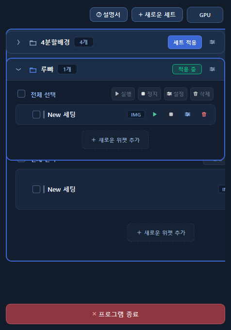
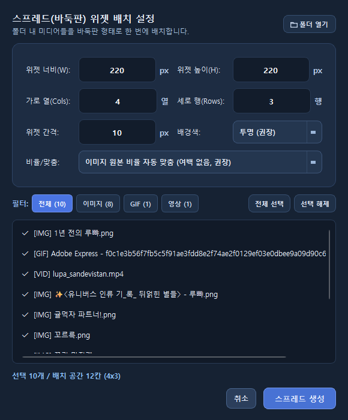
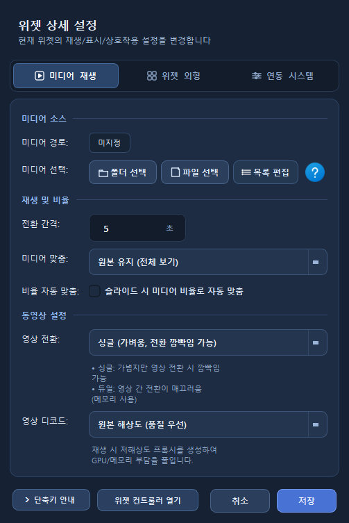
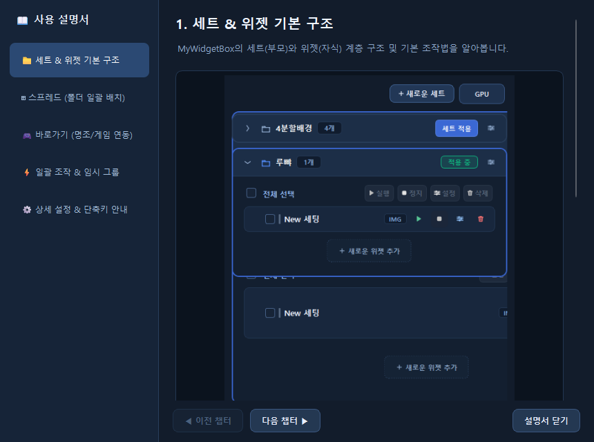

# 🌟 MyWidgetBox v2.0

> **나만의 감성 데스크톱 위젯 & 애니메이션 캔버스**  
> Customizable Desktop Widget & Animated Canvas for Windows

[-blue.svg)](#)

Windows 바탕화면에 감성적인 일러스트, 움직이는 GIF, 고화질 동영상(MP4/WebM/MKV 등)을 자유롭게 배치하고 감상할 수 있는 고성능 포터블 데스크톱 위젯 솔루션입니다.  
별도의 설치(Install) 과정 없이 **압축만 풀면 즉시 실행되는 100% 무설치(Standalone Portable)** 프로그램입니다.

---

## 📸 스크린샷 (Screenshots)

| 마스터 컨트롤러 & 세트 관리 | 스마트 스프레드 (폴더 자동 배치) |
| :---: | :---: |
|  |  |

| 게임 및 앱 실행 연동 설정 | 상세 사용자 인앱 가이드 |
| :---: | :---: |
|  |  |

---

## ✨ 주요 기능 (Key Features)

* **🎯 직관적인 드래그 & 드롭 (Drag & Drop)**
  * 파일 탐색기에서 이미지, 동영상 파일이나 폴더를 바탕화면 위젯 위로 직접 끌어다 놓으면 즉시 미디어가 교체됩니다.
  * 폴더를 드롭하면 [스프레드 일괄 배치] 또는 [슬라이드쇼]를 원클릭으로 전개할 수 있습니다.
* **📂 테마별 세트(Set) 관리 & 0ms 드래그 앤 드롭 순서 변경**
  * 상단 우측 `[+ 새 세트]` 버튼으로 작업용, 게임용, 감상용 등 테마별 위젯 세트를 독립적으로 구성하고 손쉽게 전환할 수 있습니다.
  * 세트 카드와 위젯 행의 `⠿` 그립 핸들을 끌어다 놓아 순서를 0초 만에 변경하며, 목록 순서에 따라 위젯의 앞/뒤(Z-Order)가 실시간으로 자동 동기화됩니다.
* **⊞ 스마트 스프레드 (폴더 일괄 자동 배치)**
  * 핀터레스트형 테트리스 배치, 가로 줄 맞춤, 세로 줄 맞춤 등 미디어의 원본 비율(Aspect Ratio)을 100% 보존하는 스마트 정렬 알고리즘을 지원합니다.
* **⚡ 스마트 GPU 절전 및 리소스 보호 (GPU Guard)**
  * 고사양 3D 게임을 플레이하거나 작업관리자, 웹 브라우저 등 특정 창이 전체 화면으로 활성화되면 백그라운드 위젯을 자동으로 일시 정지하여 불필요한 GPU/CPU 점유율 소모를 원천 차단합니다.
* **🖼️ 초고해상도(100MP+) 대용량 이미지 안전 디코딩**
  * 134메가픽셀(14,173×9,449) 등 초대형 디지털 아트워크도 메모리 누수 없이 4K 선명도로 부드럽고 가볍게 렌더링합니다.
* **🧲 자연스러운 자석 스냅 (Magnetic Snap with Hysteresis)**
  * 화면 모서리(10px)와 인접 위젯 테두리(4px)에 기분 좋게 달라붙고, 당길 때는 커서 밀림 없이 깔끔하게 탈출하는 물리적 히스테리시스 스냅을 지원합니다.
* **🚀 내장 미디어 재생 엔진**
  * `ffmpeg` 및 `ffprobe`가 프로그램 내부에 자체 포함되어 있어 별도의 외부 코덱을 설치할 필요가 전혀 없습니다.
* **🖥️ 윈도우 시작 시 자동 실행**
  * 컨트롤러 상단의 [윈도우 시작 시 자동 실행] 옵션을 켜두면 PC 부팅 시 사용자가 설정한 위젯들이 자동으로 복원됩니다.

---

## 🚀 빠른 시작 및 실행 방법 (Quick Start)

1. [**Releases**](https://github.com/Y-Hun-G-97/MyWidgetBox.py/releases) 탭에서 최신 버전의 `MyWidgetBox_v2.0.zip` 파일을 다운로드합니다.
2. 다운로드한 `.zip` 파일을 **원하는 위치에 압축 해제**합니다.
   * *※ 반드시 압축을 완전히 푼 후 폴더 내의 `MyWidgetBox.exe`를 실행해 주세요.*
3. `MyWidgetBox.exe`를 더블 클릭하여 실행합니다.

> 💡 **Windows SmartScreen (파란색 경고창) 안내**  
> 본 프로그램은 개인 개발자가 배포하는 비영리 오픈소스 소프트웨어로, 수십만 원의 고가 기업용 인증서가 포함되어 있지 않아 Windows에서 처음 실행 시 *"Windows의 PC 보호"* 파란색 창이 표시될 수 있습니다.  
> 본 프로젝트의 모든 소스 코드는 GitHub에 100% 투명하게 공개되어 있으니 안심하시고 **[추가 정보] ➔ [실행]** 버튼을 클릭하시면 정상 실행됩니다.

---

## ⌨️ 단축키 및 마우스 조작 (Shortcuts)

| 조작키 | 대상 | 기능 설명 |
| :--- | :--- | :--- |
| **Alt + 좌클릭** | 위젯 | 위젯 위치 고정(Lock) / 해제 토글 |
| **Alt + 휠 스크롤** | 위젯 | 위젯 레이어(바탕화면 배경 ↔ 일반 ↔ 항상 위) 즉시 전환 |
| **Ctrl + 좌클릭** | 위젯 | 개별 위젯 임시 그룹 다중 선택 추가 / 해제 (토글) |
| **Ctrl + 드래그** | 바탕화면 위젯 | 마우스 영역(박스) 드래그로 범위 내 위젯 일괄 선택 |
| **Ctrl + G** | 전역 | 선택된 모든 임시 그룹 전체 해제 |
| **Ctrl + 휠 스크롤** | 위젯 | 위젯 불투명도 5% 단위 즉시 조절 |
| **마우스 우클릭** | 위젯 | 화면 크기 맞춤, 인접 빈 공간 채우기, 상세 설정 창 열기 |
| **더블 클릭** | 컨트롤러 카드 | 위젯 이름 즉시 변경 |

---

## 💻 시스템 요구 사항 (System Requirements)

* **OS**: Windows 10 / Windows 11 (64-bit 전용)
* **RAM**: 최소 2GB 이상 (권장 4GB 이상)
* **필수 런타임**: 없음 (모든 파이썬 런타임 및 ffmpeg 바이너리 자체 내장)

---

## 📄 라이선스 (License)

이 프로젝트는 [MIT License](LICENSE)에 따라 자유롭게 사용, 수정 및 배포할 수 있습니다.
